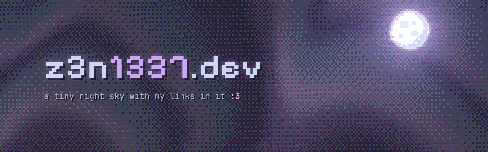
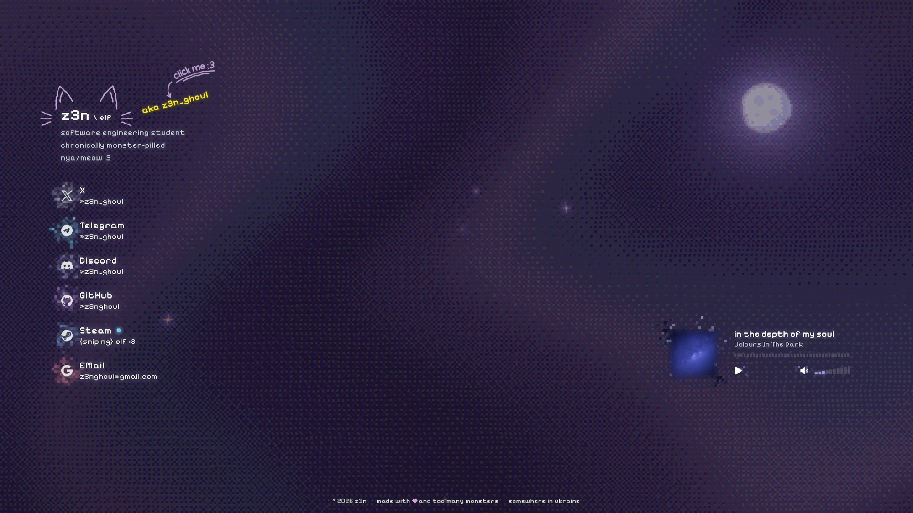
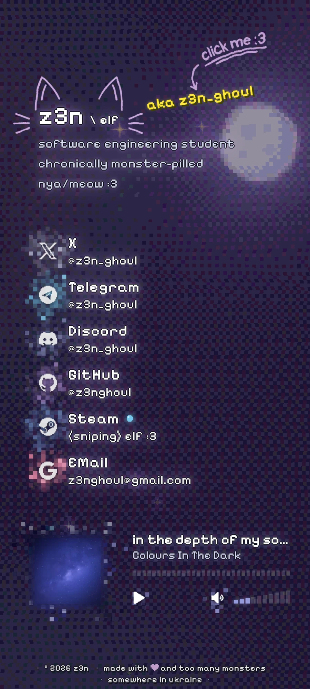

<p align="center">
  <a href="https://z3n1337.dev">
    
  </a>
</p>

<p align="center">
  <a href="https://z3n1337.dev"></a>
  
  
</p>

<p align="center">
  
  
  
  
  
  
</p>

---

My personal landing page: a pixel-art night sky with my links in it.
Plain HTML, CSS and JavaScript, no frameworks and no build step. Open `index.html` and that's it.

<table>
  <tr>
    <td width="68%"></td>
    <td width="32%"></td>
  </tr>
  <tr>
    <td align="center"><sub>desktop</sub></td>
    <td align="center"><sub>phone</sub></td>
  </tr>
</table>

## ✦ Features

- **Pixel night sky.** Drawn by a WebGL shader: a slowly moving milky way, stars that flicker in and out, shooting stars, a moon and ordered dithering. If WebGL is not available, a lighter canvas version is used instead.
- **Live Steam status.** A coloured dot next to the Steam link shows if I'm online, away or in game.
- **Now playing.** The current track from Last.fm, with a pixelated cover and a 30 second preview you can play right on the page.
- **Pixel flames.** Every link gets a small flickering halo in its own colour on hover.
- **Hand-drawn details.** Cat ears and whiskers that wobble like a sketch, a "click me" hint, a custom loading bar.
- **Random splash text.** A new line next to the nickname and in the tab title on every visit.
- **Easter eggs.** A few of them. No spoilers, click around :3
- **Works on phones.** Its own layout for small screens.

## ✦ Tech

| Part | What it uses |
| --- | --- |
| Page | HTML, CSS (nesting, `:has()`, `@property`), vanilla JS ES modules |
| Sky | WebGL1 fragment shader, Bayer dithering, Canvas 2D fallback |
| Effects | Canvas 2D pixel halos, SVG `feTurbulence` filters |
| Data | Cloudflare Worker as a proxy for the Steam and Last.fm APIs, iTunes Search for previews |
| Hosting | GitHub Pages via GitHub Actions |

## ✦ Project structure

```text
.
├── index.html               # the page
├── css/
│   └── style.css            # all styles
├── js/
│   ├── main.js              # entry point, imports every module
│   ├── bg.js                # WebGL sky
│   ├── bg-orbs.js           # fallback sky without WebGL
│   ├── flames.js            # pixel halos around the links
│   ├── player.js            # Last.fm "now playing" player
│   ├── player-glow.js       # glow around the player
│   ├── steam.js             # Steam status dot
│   ├── eggs.js              # easter eggs
│   ├── splashes.js          # random splash lines
│   ├── loader.js            # loading screen
│   ├── ears.js              # wobbly cat ears
│   └── ...                  # small helpers
├── img/                     # icons, favicon, share image
├── cloudflare/
│   └── steam-worker.js      # API proxy (Steam + Last.fm)
└── .github/workflows/
    └── pages.yml            # deploy to GitHub Pages
```

## ✦ Run locally

Any static server works. ES modules don't load from `file://`, so a server is needed:

```bash
python -m http.server 8080
```

Then open <http://localhost:8080>. Add `?debug` to the URL to see the dev panel.

## ✦ Worker

The Steam and Last.fm keys live in a Cloudflare Worker, so they never reach the browser.
The worker has two routes, `/steam` and `/lastfm`, and needs these secrets:

```bash
wrangler secret put STEAM_API_KEY
wrangler secret put STEAM_ID
wrangler secret put LASTFM_API_KEY
```

The worker URL is set in [`js/config.js`](js/config.js).

## ✦ Deploy

Every push to `main` or `beta` runs [`pages.yml`](.github/workflows/pages.yml):

- `main` → <https://z3n1337.dev>
- `beta` → <https://z3n1337.dev/beta> (hidden from search engines)

---

<p align="center">
  <sub>made with 💜 and too many monsters · somewhere in ukraine</sub>
</p>
